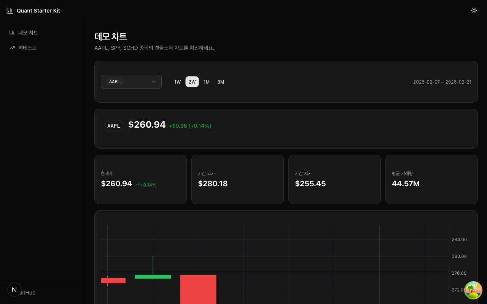
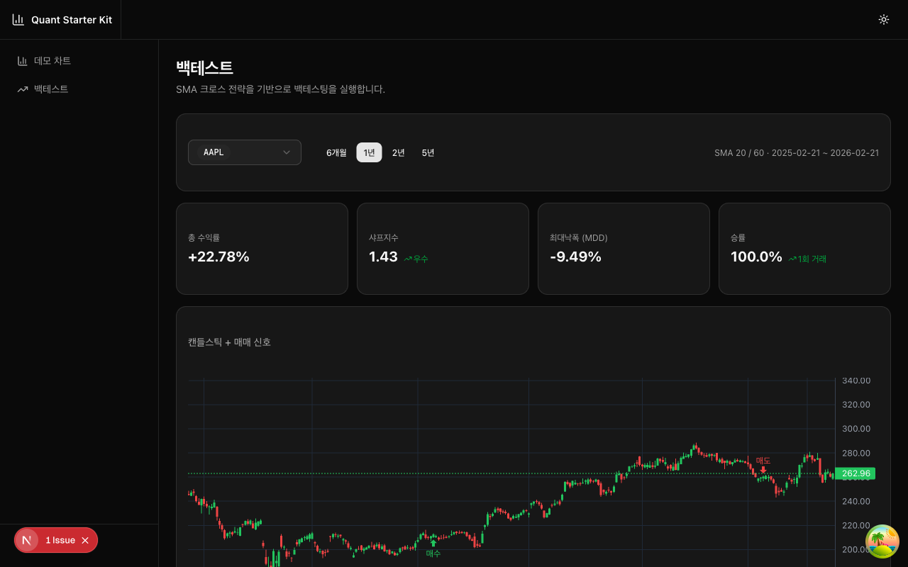

# Quant Backtesting Starter Kit

Yahoo Finance 데이터를 기반으로 한 주식 차트 시각화 및 SMA 크로스 전략 백테스팅 스타터 킷입니다.
Next.js 16 App Router + TradingView 경량 차트 + shadcn/ui 프론트엔드와 FastAPI + yfinance 백엔드로 구성되어 있습니다.

---

## 스크린샷

| 데모 차트 페이지 | 백테스트 페이지 |
|:-:|:-:|
|  |  |

---

## 주요 기능

### 데모 차트
- **캔들스틱 차트**: TradingView lightweight-charts v5로 OHLCV 데이터 시각화
- **거래량 히스토그램**: 차트 하단에 거래량 바 차트 병렬 표시
- **종목 선택**: AAPL (애플), SPY (S&P 500 ETF), SCHD (배당 ETF)
- **기간 선택**: 1주일 / 2주일 / 1개월 / 3개월

### 백테스트
- **SMA 크로스 전략**: SMA-20 / SMA-60 골든크로스·데드크로스 기반 자동 매매 시뮬레이션
- **성과 지표 4종**: 총 수익률 / 샤프지수 / 최대낙폭(MDD) / 승률
- **매매 신호 시각화**: 캔들스틱 차트 위에 매수·매도 신호 마커 표시
- **수익률 곡선**: 초기 투자금 100 기준 포트폴리오 가치 추이
- **워밍업 분리**: 요청 기간보다 130 캘린더일 앞 데이터로 SMA 사전 워밍업 → 단기(6개월) 분석에서도 정확한 신호 생성

### 공통
- **다크/라이트 모드**: 시스템 설정 연동 또는 수동 전환
- **반응형 레이아웃**: 데스크톱 사이드바 + 모바일 Sheet 드로어
- **API 캐싱**: ISR 5분 설정으로 불필요한 Yahoo Finance 요청 최소화

---

## 기술 스택

| 카테고리 | 기술 |
|---------|------|
| 프레임워크 | Next.js 16.1.6 (App Router) + React 19 + TypeScript 5 |
| 스타일링 | Tailwind CSS v4 + shadcn/ui (new-york 스타일) |
| 차트 | lightweight-charts v5 (TradingView) |
| 서버 상태 | TanStack Query v5 |
| 유틸리티 | date-fns v3, lucide-react, Radix UI |
| 백엔드 | FastAPI + uvicorn |
| 데이터 | yfinance, pandas, numpy |

---

## 시작하기 (사용자)

### 요구사항

- Node.js 18.17 이상
- Python 3.11 이상
- npm / yarn / pnpm / bun 중 하나

### 설치 및 실행

#### 1. 프론트엔드 (Next.js)

```bash
# 저장소 클론
git clone https://github.com/DennisJung/starter-kit.git
cd starter-kit

# 의존성 설치
npm install

# 개발 서버 실행
npm run dev
```

브라우저에서 [http://localhost:3000](http://localhost:3000)을 열면 `/demo` 페이지로 자동 이동합니다.

#### 2. 백엔드 (FastAPI)

백테스트 기능을 사용하려면 FastAPI 서버를 함께 실행해야 합니다.

```bash
cd backend

# 가상환경 생성 및 활성화
python -m venv .venv
source .venv/bin/activate   # Windows: .venv\Scripts\activate

# 의존성 설치
pip install -r requirements.txt

# 개발 서버 실행 (포트 8000)
uvicorn main:app --reload --port 8000
```

### 사용 방법

#### 데모 차트
1. 사이드바에서 **데모 차트**를 클릭합니다
2. 상단 드롭다운에서 종목을 선택합니다 (AAPL / SPY / SCHD)
3. 기간 버튼으로 차트 범위를 선택합니다 (1W / 2W / 1M / 3M)
4. 캔들스틱 차트와 주요 지표(현재가, 변동률, 52주 고/저가, 거래량)를 확인합니다

#### 백테스트
1. 사이드바에서 **백테스트**를 클릭합니다
2. 종목(AAPL / SPY / SCHD)과 기간(6개월 / 1년 / 2년 / 5년)을 선택합니다
3. 성과 지표 4종과 매매 신호가 표시된 캔들스틱 차트를 확인합니다
4. 수익률 곡선으로 포트폴리오 가치 추이를 분석합니다

---

## 프로젝트 구조 (개발자)

```
.
├── app/
│   ├── api/
│   │   └── stock/[ticker]/route.ts      # Yahoo Finance API 프록시 (ISR 5분 캐싱)
│   ├── demo/page.tsx                    # 데모 차트 페이지
│   ├── backtest/page.tsx                # 백테스트 페이지
│   ├── layout.tsx                       # 루트 레이아웃 (Provider 주입)
│   └── page.tsx                         # / → /demo 리다이렉트
│
├── components/
│   ├── layout/                          # Layer 1: AppShell, Header, Sidebar
│   ├── ui/                              # Layer 2: shadcn/ui 원자 컴포넌트
│   ├── composite/                       # Layer 3: MetricCard, StockSelector, EmptyState
│   └── features/
│       ├── chart/                       # Layer 4: CandlestickChart, ChartToolbar
│       ├── stock/                       # Layer 4: StockDemoPanel, StockMetricsGrid
│       └── backtest/                    # Layer 4: BacktestPanel, BacktestMetricsGrid
│
├── hooks/
│   ├── useStockData.ts                  # React Query 기반 주식 데이터 조회
│   ├── useBacktest.ts                   # React Query 기반 백테스트 실행
│   ├── useTheme.ts                      # 다크/라이트 테마 상태
│   └── useMediaQuery.ts                 # 반응형 브레이크포인트 감지
│
├── lib/
│   ├── types.ts                         # 공통 타입 (Ticker, OHLCVData, BacktestRequest 등)
│   ├── constants.ts                     # 종목 메타데이터, 기간 설정
│   ├── formatters.ts                    # 날짜/숫자 포맷터
│   └── utils.ts                         # cn() 등 유틸리티
│
├── providers/
│   └── QueryProvider.tsx                # TanStack Query 설정
│
└── backend/                             # FastAPI 백테스트 서버
    ├── main.py                          # FastAPI 앱 진입점, CORS 설정
    ├── backtest.py                      # SMA 크로스 전략 백테스팅 엔진
    └── requirements.txt                 # Python 의존성
```

### 컴포넌트 5계층 구조

```
Layer 1 → Layout    : AppShell / Header / Sidebar
Layer 2 → UI        : shadcn/ui 원자 컴포넌트 (Button, Card, Sheet 등)
Layer 3 → Composite : StockSelector / MetricCard / EmptyState
Layer 4 → Features  : CandlestickChart / StockDemoPanel / BacktestPanel
Layer 5 → Pages     : app/demo/page.tsx / app/backtest/page.tsx
```

### 데이터 흐름

#### 데모 차트
```
사용자 (ticker, period 선택)
  ↓
StockDemoPanel → useStockData() [React Query]
  ↓
GET /api/stock/[ticker]?from=&to=   [Next.js API Route, ISR 5분]
  ↓
Yahoo Finance v8 Chart API
  ↓
OHLCV 정규화 (null 필터링, 소수점 2자리)
  ↓
CandlestickChart (lightweight-charts v5)
StockMetricsGrid (MetricCard 목록)
```

#### 백테스트
```
사용자 (ticker, period 선택)
  ↓
BacktestPanel → useBacktest() [React Query]
  ↓
POST /api/backtest/sma   [Next.js API Route → FastAPI 프록시]
  ↓
FastAPI (backtest.py)
  ├─ yfinance 조회 (from_date - 130일 확장 → SMA 워밍업)
  ├─ SMA-20 / SMA-60 계산
  ├─ 골든크로스·데드크로스 신호 감지
  └─ 포지션 시뮬레이션 (초기 포지션 자동 반영)
  ↓
BacktestMetrics (총 수익률, 샤프지수, MDD, 승률, 거래 횟수)
BacktestSignals (매수·매도 신호 날짜·가격)
EquityCurve (일별 포트폴리오 가치)
  ↓
CandlestickChart + 신호 마커
수익률 곡선 차트 (LineSeries)
```

### API 레퍼런스

#### `GET /api/stock/[ticker]` — 주식 데이터 조회

| 파라미터 | 타입 | 예시 | 설명 |
|---------|------|------|------|
| `ticker` | path | `AAPL` | 종목 코드 |
| `from` | query | `2024-01-01` | 시작일 (YYYY-MM-DD) |
| `to` | query | `2024-03-31` | 종료일 (YYYY-MM-DD) |

**응답 예시:**
```json
[
  { "time": "2024-01-02", "open": 185.64, "high": 186.99, "low": 183.74, "close": 185.20, "volume": 70893280 }
]
```

#### `POST /backtest/sma` — SMA 크로스 백테스트 실행

**요청 본문:**
```json
{
  "ticker": "AAPL",
  "from_date": "2025-02-21",
  "to_date": "2026-02-21"
}
```

**응답 예시:**
```json
{
  "signals": [
    { "date": "2025-03-15", "type": "buy", "price": 220.50 },
    { "date": "2025-08-10", "type": "sell", "price": 240.30 }
  ],
  "equity_curve": [
    { "time": "2025-02-21", "value": 100.0 },
    { "time": "2025-02-24", "value": 100.0 }
  ],
  "metrics": {
    "total_return": 0.2278,
    "sharpe_ratio": 1.43,
    "max_drawdown": -0.0949,
    "win_rate": 1.0,
    "trade_count": 1
  }
}
```

### 주요 타입

```typescript
type Ticker = "AAPL" | "SPY" | "SCHD";

interface OHLCVData {
  time: string;      // "YYYY-MM-DD"
  open: number;
  high: number;
  low: number;
  close: number;
  volume: number;
}

interface BacktestRequest {
  ticker: string;
  from_date: string;   // "YYYY-MM-DD"
  to_date: string;     // "YYYY-MM-DD"
}

interface BacktestMetrics {
  total_return: number;   // 소수 (0.1234 = 12.34%)
  sharpe_ratio: number;
  max_drawdown: number;   // 음수 (-0.082 = -8.2%)
  win_rate: number;       // 소수 (0.6 = 60%)
  trade_count: number;
}
```

### 새 종목 추가 방법

1. `lib/types.ts` — `Ticker` 유니온에 종목 코드 추가
2. `lib/constants.ts` — `TICKERS` 배열에 메타데이터 추가

```typescript
// lib/constants.ts 예시
{ value: "QQQ", label: "QQQ", description: "나스닥 100 ETF" }
```

### 백테스트 전략 파라미터 변경

`backend/backtest.py` 상단의 상수를 수정합니다:

```python
SMA_SHORT = 20        # 단기 이동평균 기간 (일)
SMA_LONG  = 60        # 장기 이동평균 기간 (일)
INITIAL_CAPITAL = 1_000_000  # 초기 자본 (원)
```

> SMA_LONG을 변경할 경우, 워밍업 확장 기간(`timedelta(days=130)`)도 함께 조정하세요.

### 스크립트

```bash
# 프론트엔드
npm run dev      # 개발 서버 (http://localhost:3000)
npm run build    # 프로덕션 빌드
npm run start    # 프로덕션 서버 실행
npm run lint     # ESLint 검사

# 백엔드
cd backend
uvicorn main:app --reload --port 8000   # 개발 서버 (자동 리로드)
uvicorn main:app --port 8000            # 프로덕션 서버
```

---

## 로드맵

| Phase | 상태 | 내용 |
|-------|------|------|
| Phase 1 | ✅ 완료 | Yahoo Finance 연동, 캔들스틱 차트, 반응형 레이아웃 |
| Phase 2 | ✅ 완료 | FastAPI 백엔드 + SMA 크로스 백테스팅 엔진 + 성과 지표 |
| Phase 3 | 📋 계획 | 전략 파라미터 튜닝 UI, 복수 전략 비교, 리포트 내보내기 |

---

## 라이선스

MIT
